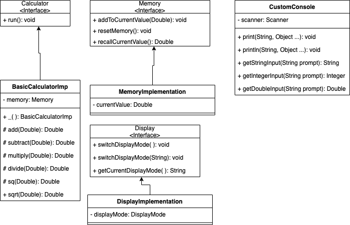
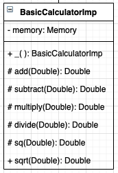

# Instructions for your Group

Welcome to your groups first assignment!!! Your objective is to work together to complete the following lab:

[TDD Lab](https://github.com/code-differently/TDD-Sci-Calculator)

The product owner should be the one who forks the repo, the rest of the team should be added to the product owners repo.

Your first step is to complete the UML Diagram in : [Draw.io](http://draw.io/)

Once you complete the UML you must get that approved by your instructor.

## How to Diagram Java Classes with UML

Since the very beginning of computer programming, before the popularity of Java, programmers have loved to create diagrams of their programs. Originally, they drew flowcharts that graphically represented a program’s procedural logic.

Flowcharts were good at diagramming procedures, but they were way too detailed. When the structured programming craze hit in the 1970s, and programmers started thinking about the overall structure of their programs, they switched from flowcharts to structure charts, which illustrated the organizational relationships among the modules of a program or system.

Now that object-oriented programming is the thing, programmers draw class diagrams to illustrate the relationships among the classes that make up an application. This image shows a class diagram of a simple system that has four classes. The rectangles represent the classes themselves, and the arrows represent the relationships among the classes.




***Note: The above UML covers all of the UML for the classes you need accept ScientificCalculator.***


You can draw class diagrams in many ways. To add some consistency to their diagrams, most programmers use a standard called UML, which stands for Unified Modeling Language. The class diagram in above is an example of a simple UML diagram, but UML diagrams can get much more complicated.

The following information describe the details of creating UML class diagrams. Note that it doesn’t even come close to explaining all the features of UML.

## Drawing classes

The basic element in a class diagram is a class. In UML, each class is drawn as a rectangle. At minimum, the rectangle must include the class name. You can subdivide the rectangle into two or three compartments that can contain additional information about the class.



The middle compartment of a class lists the class variables, whereas the bottom compartment lists the class methods. The name of each variable or method can be preceded by a visibility indicator, which can be one of the symbols listed below. (In actual practice, it’s common to omit the visibility indicator and list only those fields or methods that have public visibility.)

| Indicator  | Description   | 
|---|---|
|  + | Public   | 
| -  | Private   | 
| #  | Protected   |

If you want, you can include type information for variables as well as for methods and parameters. The type of a variable is indicated by following the variable name with a colon and the type:

```
connectionString: String
```

A method’s return type is indicated in the same way:

```
getCustomer(custno: int): Customer
```

## Drawing Arrows

Besides using rectangles to represent classes, class diagrams include arrows to represent relationships among classes. UML uses a variety of types of arrows.

* A solid line with a hollow closed arrow at one end represents inheritance.
* The arrow points to the base class. A dashed line with a hollow closed arrow at one end indicates that a class implements an interface.
* The arrow points to the interface. A solid line with an open arrow indicates an association.

An association simply indicates that two classes work together. It may be that one of the classes creates objects of the other class or that one class requires an object of the other class to perform its work. Or perhaps instances of one class contain instances of the other class.

You can add a name to an association arrow to indicate its purpose. If an association arrow indicates that instances of one class create objects of another class, you can place the word `Creates` next to the arrow.

# Now Writing the Test

You need to complete a unit test for every public/protected method in each class.

If you want another resource for TDD here is an amazing video: 
[TDD](https://www.youtube.com/watch?v=z6gOPonp2t0&t=42s)

I highly recomend... infact its mandatory!

Remember we did a similar lab recently 

Operations.java

```

public class Operations {

    /**
     * The addition function.
     * @param x The first operand
     * @param y The second operand
     * @return the sum of x and y
     */
    public static int add(int x, int y) {
        return x + y;
    }

    /**
     * The subtraction function
     * @param x The first operand
     * @param y The second operand
     * @return y taken from x
     */
    public static int subtract(int x, int y) {
        return x - y;
    }


    /**
     * The multiplication function
     * @param x The first operand
     * @param y The second operand
     * @return x times y
     */
    public static int multiply(int x, int y) {
        return x * y;
    }
}

```

OperationsTest.java

```

import org.junit.Assert;
import org.junit.Test;

public class OperationsTest {

    @Test
    public void testAdd() throws Exception {
        // Given
        int x = 1;
        int y = 1;

        //When
        int expected = 2;
        int actual = Operations.add(x, y);

        //Then
        Assert.assertEquals(expected,actual);
    }

    @Test
    public void testSubtract() throws Exception {
        // Given
        int x = 1;
        int y = 1;

        //When
        int expected = 0;
        int actual = Operations.subtract(x, y);

        //Then
        Assert.assertEquals(expected,actual);
    }

    @Test
    public void testMultiply() throws Exception {
        // Given
        int x = 2;
        int y = 2;

        //When
        int expected = 4;
        int actual = Operations.multiply(x, y);

        //Then
        Assert.assertEquals(expected, actual);
    }
}

```